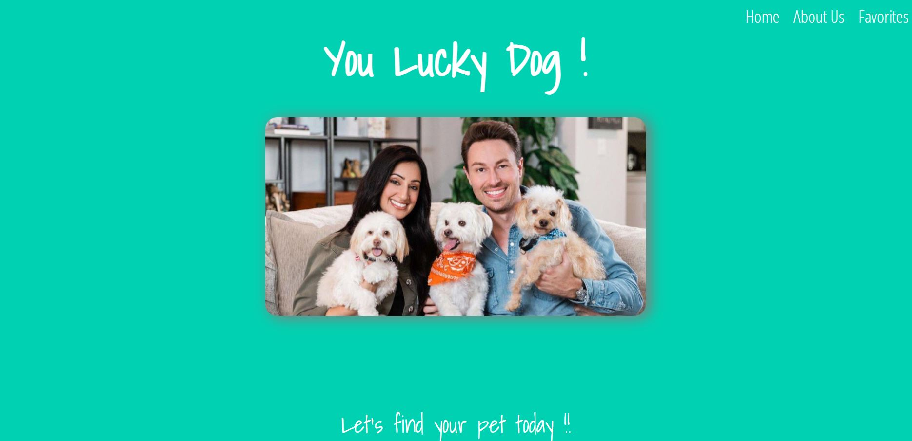
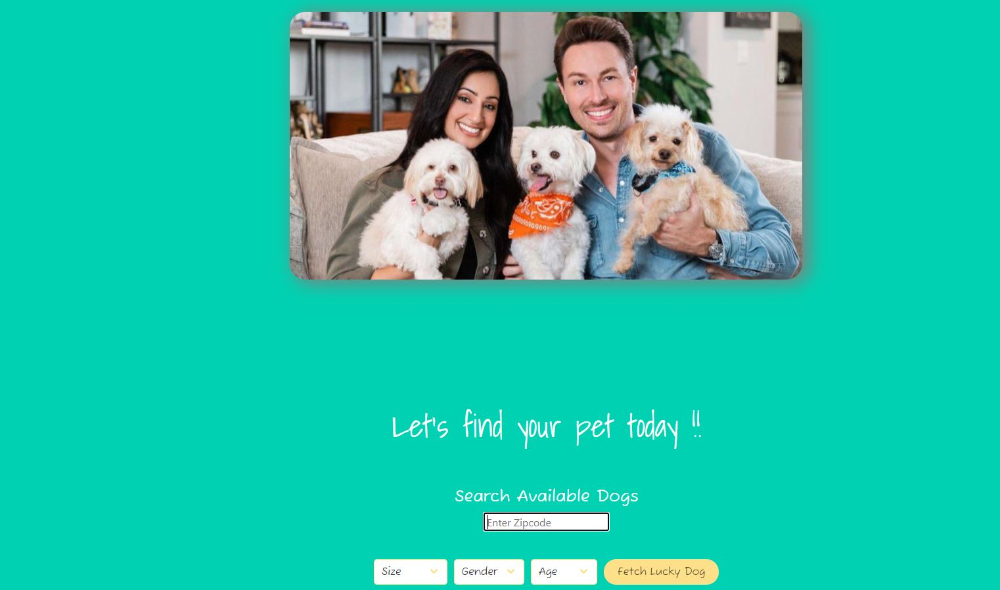
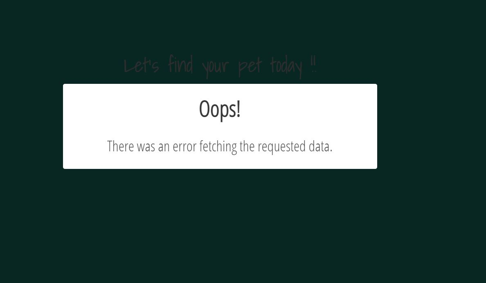
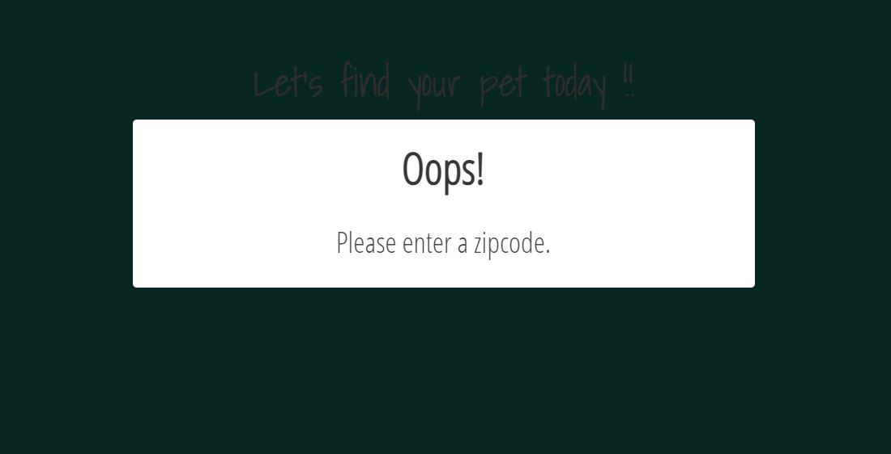
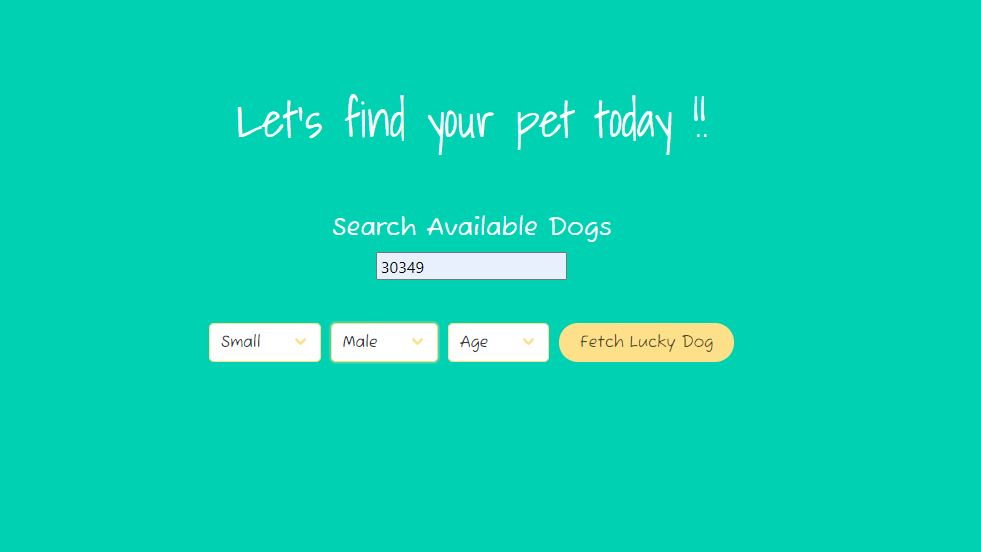
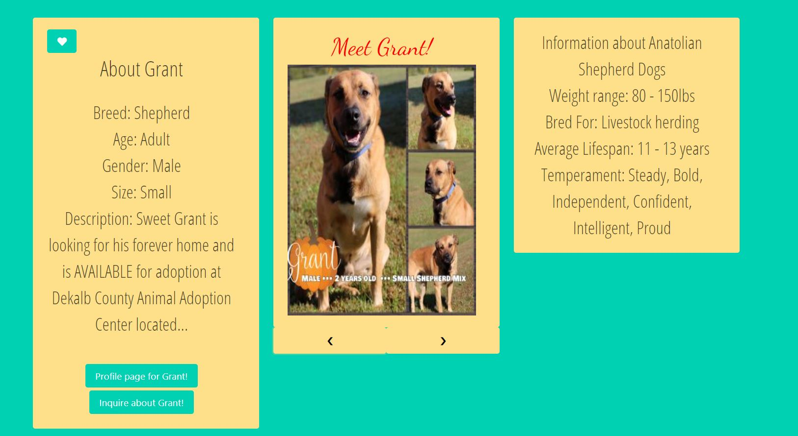
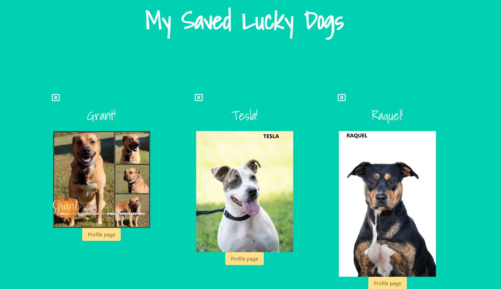
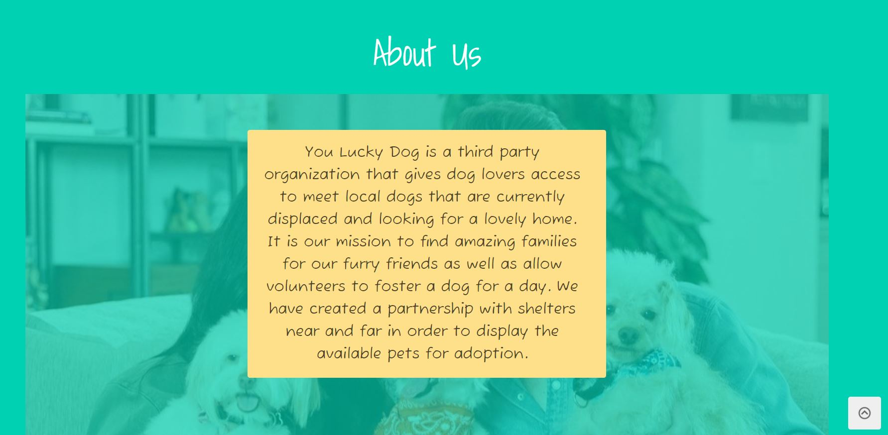

# You Lucky Dog 

## Description

This is a web application that allows users to search for dogs available for adoption in their area using a zipcode. This application 
specifically highlights dogs with special needs, older dogs and dogs which finding homes for is more difficult. Users are able to view adoptable dogs in their area and their details such as age, breed, size and gender. Information about the shelter where the dog is located is also shown when the user goes to the dog's profile page.  If a user identify any dogs that he/she would want to learn more information about at a later time, then he/she is able to save the dog’s profile to a favorites page and also fill out a form to contact the shelter regarding the dog.  You Lucky Dog is more than just a search platform but aim to provide users with resources, including what to expect with different dog breeds.

## User Stories

- AS A potential dog adopter 
- I WANT TO have the ability to search for adoptable dogs in my area based on age, size, and gender 
- SO THAT I can find a dog to adopt

- AS A potential dog adopter 
- I WANT TO be able to save dogs I like to a favorites page 
- SO THAT I can view them again at a later time

- AS A potential dog adopter
- I WANT TO see a shelter’s details and adoption requirements 
- SO THAT I can adopt a dog

- AS A potential dog adopter 
- I WANT to see details about different dog breeds
- SO THAT I know whether a specific dog will be a good fit for my household

## Usage

- The user will browse to the landing page and will be invited with the title of the page, active navigation links and a picture of a lovely pet family.

- As the user scrolls down, there is an input field for the user to type in a valid zipcode. The user is also given an option to choose a size, age or gender of the desired pet but a selection does not have to be made. Should the user give an invalid zipcode, a modal will appear advising that the zipcode is invalid. If the user fails to enter a zipcode at all, the user will be advised to enter in a zipcode. 

- Once the user has entered a valid zipcode and made any desired selections, the results will populate for those criteria and the user is able to scroll through the results where information such as breed, gender, age, name and other detailed information is displayed. 

- If the user finds any dogs that he/she would like to add to his/her favorites list, the user will have the ability to click on the heart icon to add that pet to a favorites list. Once on the favorites list, the dog's name and picture will display as well as a link to the dog profile page. Should a user have the desire to remove a dog as a favorite, then he/she has the ability to delete that particular dog from the favorite list. 

- In the event that the user will like to learn more information about the You Lucky Dog organization, there is an about us section below the results on the main landing page. 

## Features

- Zipcode search functionality
- Search criteria options
- Gathering of dog's personalized information
- Ability to create a favorites list
- User email contact for dog interest 

## Future Development

Park Finder 
    - Find local dog parks nearby

Doggy Dates
    - Meet mutual dog lovers nearby for a mid-day stroll with with your pets

Highlight Reel
    - Meet the lucky dog of the day!

Volunteer Calendar
    - Shows available times and dates to volunteer at a local shelter

## Resources and Technologies Used

Basic styling and layouts:  https://bulma.io/documentation/

Pet finder API: https://www.petfinder.com/developers/v2/docs/#request-structure

The Dog API:  https://api.thedogapi.com

Google Fonts: https://fonts.googleapis.com/css2?family=Dancing+Script&family=Fuzzy+Bubbles&family=Open+Sans+Condensed:wght@300&family=Shadows+Into+Light&display=swap

Font Awesome: https://use.fontawesome.com/releases/v5.8.1/css/all.css

## License
This project is licensed under the terms of the MIT license.

## Additional Guidance

Please be aware that the API references in the code were for demo purposes only and will not be active.  To make your own project using this code, be sure to create your own accounts with the API providers in order to get API keys to use in your code.  Replace the existing placeholder keys (i.e. where it says "apikey=" or "client_id" with your own.  As always, be sure to read the documentation from the API providers for a full understanding of what keys are required for making the calls and other terms and conditions.

## Contact Us
Visit the profile pages of the collaborators to get in touch:
    jddlwlr
    javiscarr
    mel-ificent

## Deployed Link

https://jddlwlr.github.io/You-Lucky-Dog/

